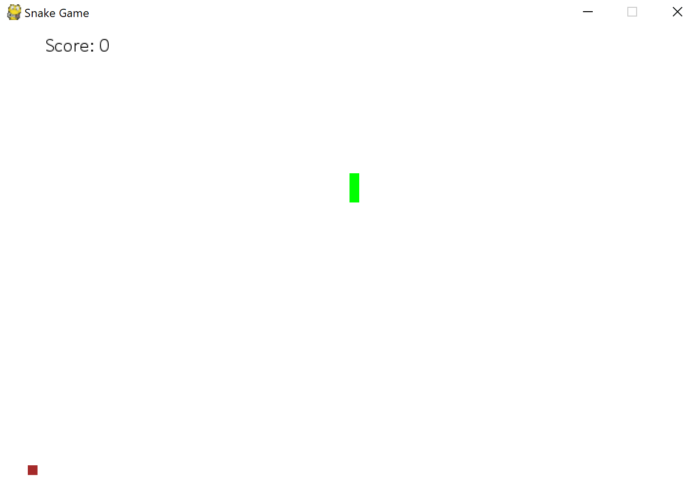

# Python Snake

Based on the Udemy course Python Game Development : Creating a Snake Game from scratch (https://www.udemy.com/python-game-development-creating-a-snake-game-from-scratch/learn/v4/overview)

## Description

A simple snake game.

## How to play

If you have Python installed on your system, run
```
python pythonsnake.py
```
from the game directory.

## Extensions

DONE:
1. Game menu

TODO:
1. Pause screen
2. Background music

## Screenshots




