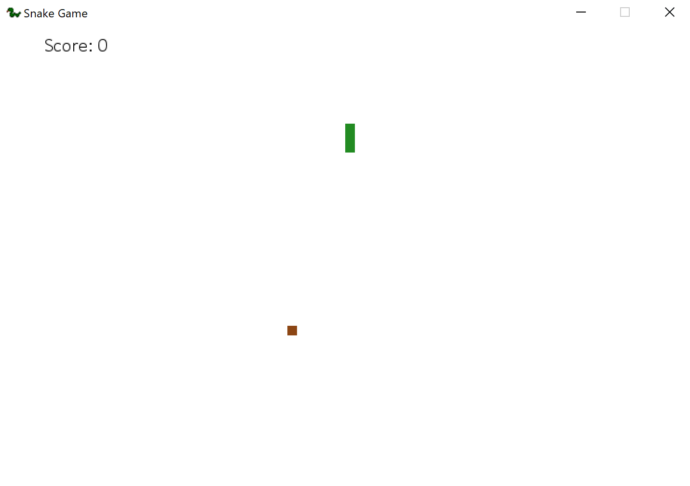

# Python Snake

## Description

A simple snake game based on the Udemy course [Python Game Development : Creating a Snake game from scratch](https://www.udemy.com/python-game-development-creating-a-snake-game-from-scratch/learn/v4/overview).

## How to run

If you have Python installed on your system, run
```
python pythonsnake.py
```
from the game directory.

## Screenshots





