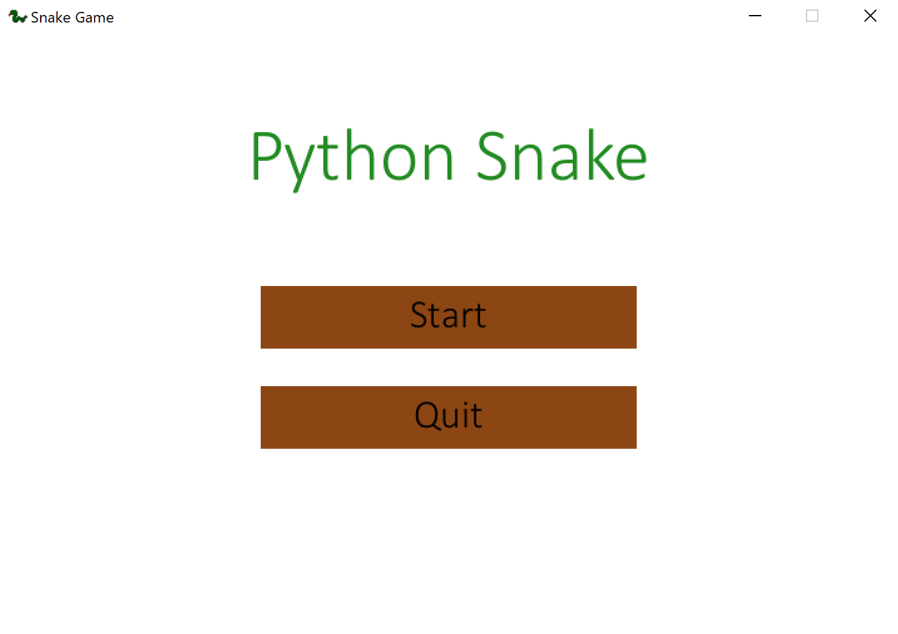
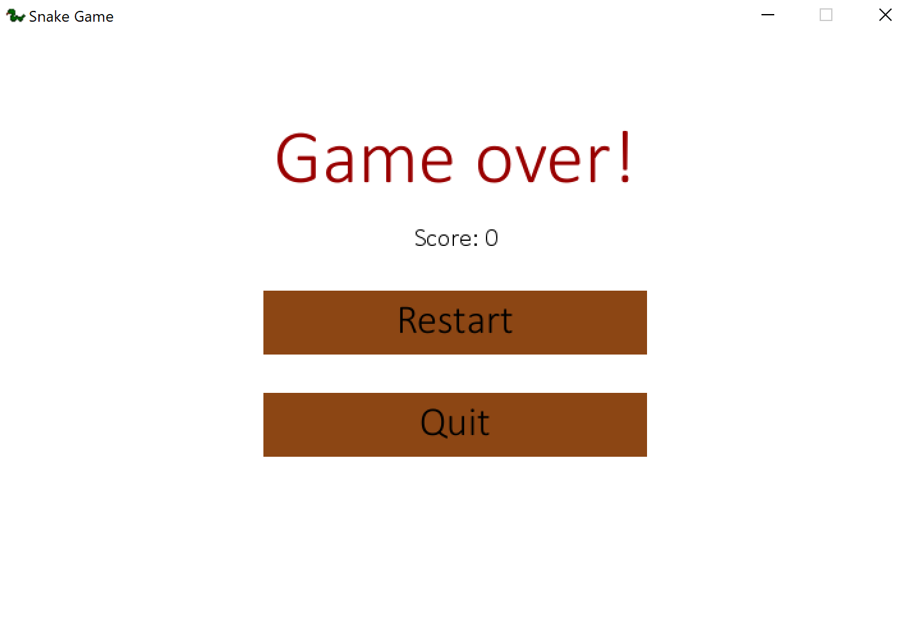

# Python Snake

Based on the Udemy course Python Game Development : Creating a Snake Game from scratch (https://www.udemy.com/python-game-development-creating-a-snake-game-from-scratch/learn/v4/overview)

## Description

A simple snake game.

## How to play

Run the executable in (./dist/pythonsnake/pythonsnake.exe)

## Extensions

DONE:

TODO:

1. Pause screen
2. Exit screen that allows restart/quit
3. Background music

## Screenshots

